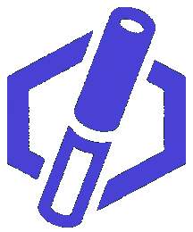
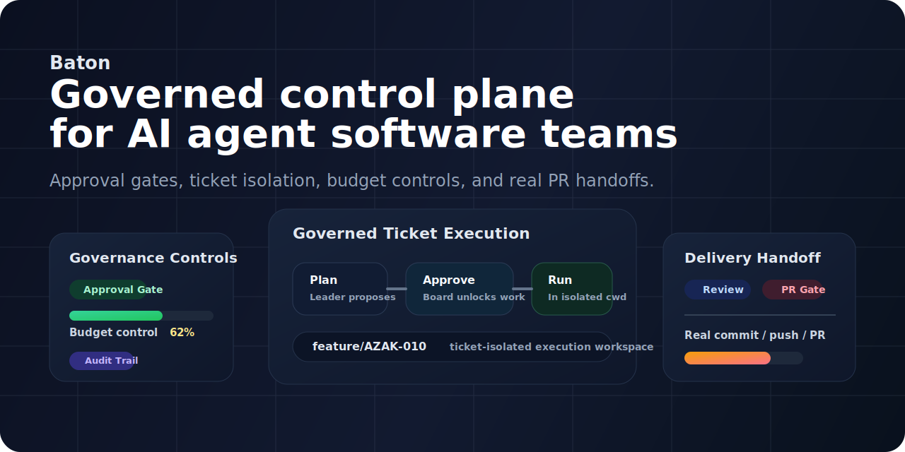
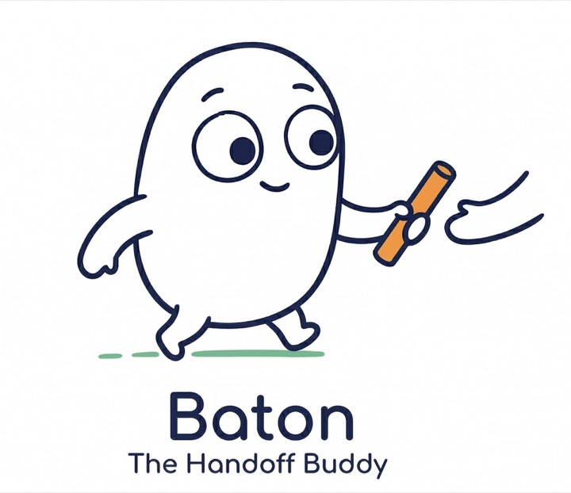

<p align="center">
  
</p>

# Baton



**AI 에이전트 소프트웨어 팀을 위한 거버넌스 중심 컨트롤 플레인**

승인 게이트, 티켓별 격리 워크스페이스, 예산 제어, 실제 PR handoff를 갖춘 자율 코딩 워크플로우를 운영하세요.

[English](./README.md) | [한국어](./README.ko.md)

[](./LICENSE)
[](https://nodejs.org/)
[](https://pnpm.io/)
[](#핵심-기능)
[](#왜-baton인가)

> Baton은 AI 에이전트를 실제 소프트웨어 전달 워크플로우에 투입하면서도 검토 가능성, 통제력, 운영 안정성을 잃지 않도록 돕습니다.

## 데모

[](./docs/media/baton-readme-keypoints.mp4)

흐름: 회사 선택, 대시보드, 이슈 보드, 이슈 상세, 에이전트 화면.

## 왜 Baton인가

대부분의 에이전트 프레임워크는 에이전트 워크플로우를 구성하는 데 초점을 둡니다. Baton은 소프트웨어 실행을 거버넌스 가능한 방식으로 운영하는 데 초점을 둡니다.

Baton은 계획과 구현을 분리하고, 승인 이후에만 코드 실행을 열며, 각 티켓을 전용 실행 워크스페이스에 격리하고, 리뷰와 풀 리퀘스트를 프롬프트 관례가 아니라 워크플로우의 일부로 다룹니다.

- 구현 전에 승인 게이트 적용
- 티켓별 격리 실행 워크스페이스
- 리뷰와 PR handoff를 워크플로우가 강제하는 단계로 취급
- 예산 제한과 hard-stop 제어
- 어느 시점에서든 가능한 board 개입
- 회사 단위 가시성과 감사 추적

## 동작 방식

1. 보드 운영자가 상위 티켓을 만들고 리더 에이전트에게 할당합니다.
2. 리더 에이전트가 작업 계획을 세우고 승인을 요청합니다.
3. 승인 후 Baton이 티켓 전용 실행 워크스페이스를 준비합니다.
4. 구현 에이전트는 기본 저장소 체크아웃이 아니라 격리된 워크스페이스 안에서 작업합니다.
5. 완료된 작업은 조용히 `done`으로 끝나지 않고 리뷰 단계로 넘겨집니다.
6. Baton은 브랜치 상태를 검증하고 PR 승인을 열며, 실제 git/PR side effect가 끝난 뒤에만 티켓을 닫습니다.

Baton에서 `done`은 거버넌스 워크플로우가 실제로 닫혔다는 뜻입니다.

## Governed Handoff를 위해 만들어진 이름

Baton이라는 이름은 이어달리기 바통에서 왔습니다. 작업은 planner에서 implementer로, reviewer로 넘어가지만, 통제되지 않은 handoff로 흘러가서는 안 됩니다.

Baton은 각 전달 과정을 보이게 만들고, 검토 가능하게 만들고, 거버넌스 가능한 상태로 유지합니다.

<p align="center">
  
</p>

## 핵심 기능

- 채용, 계획, PR에 대한 거버넌스 승인
- 티켓 격리를 위한 Baton 관리 실행 워크스페이스
- Claude Code, Codex, Gemini, Cursor 및 HTTP/process 기반 에이전트 지원
- soft alert와 hard-stop auto-pause를 포함한 예산 제어
- 회사 단위 조직도, 태스크, 목표, 활동 로그
- `DATABASE_URL` 없이도 embedded PostgreSQL로 바로 시작 가능한 로컬 우선 설정
- 대시보드, 이슈, 승인, 비용, 개입을 위한 board UI

## 에이전트 프레임워크와의 차이

프레임워크는 에이전트 시스템을 조합하는 데 강합니다. Baton은 이를 거버넌스가 있는 전달 워크플로우로 운영하는 데 강합니다.

승인 게이트, 워크스페이스 격리, 예산 통제, PR 생명주기 제어가 오케스트레이션만큼 중요하다면 Baton이 더 잘 맞습니다.

## 빠른 시작

```bash
git clone https://github.com/atototo/baton.git
cd baton
pnpm install
pnpm dev
```

`http://localhost:3100` 를 엽니다.

로컬 인스턴스 온보딩:

```bash
pnpm baton onboard
```

요구 사항:
- Node.js 20+
- pnpm 9+

## 개발

```bash
pnpm dev
pnpm dev:server
pnpm build
pnpm typecheck
pnpm test:run
pnpm db:generate
pnpm db:migrate
```

## 로드맵

- 더 정교한 governed workflow 정책, reviewer routing, 그리고 안전한 execution handoff
- 더 나은 에이전트 팀 구성, 조직 설계, 역할별 운영 패턴
- 사람 운영자와 에이전트 팀을 잇는 메신저형 커뮤니케이션 흐름
- 실제 작업을 기준으로 한 에이전트 평가, 성과 이력, 운영 인사이트
- 감독, 개입, 예산, 회사 상태를 다루는 관리자 대시보드 고도화

## Attribution

Baton은 [paperclipai/paperclip](https://github.com/paperclipai/paperclip)의 원작을 기반으로 하며, 거버넌스 중심 소프트웨어 전달 워크플로우, 브랜딩, 현지화를 중심으로 재구성되었습니다.

## License

MIT. 자세한 내용은 [LICENSE](./LICENSE)를 참고하세요.
