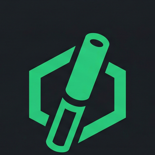

<p align="center">
  
</p>

# Baton


**Governed control plane for AI agent software teams**

Run autonomous coding workflows with approval gates, ticket-isolated workspaces, budget controls, and real PR handoffs.

[English](./README.md) | [한국어](./README.ko.md)

[](./LICENSE)
[](https://nodejs.org/)
[](https://pnpm.io/)
[](#core-features)
[](#why-baton)

> Baton helps teams run AI agents in real software delivery workflows without giving up reviewability, control, or operational safety.

## Demo

[](./docs/media/baton-readme-keypoints.mp4)

Flow: company selection, dashboard, issue board, issue detail, and agent views.

## Why Baton

Most agent frameworks help you build agent workflows. Baton helps you govern software execution.

Baton separates planning from implementation, opens code execution only after approval, isolates each ticket in its own execution workspace, and treats review and pull requests as part of the workflow itself.

- Approval gates before implementation
- Ticket-isolated execution workspaces
- Review and PR handoffs as workflow-enforced steps
- Budget limits and hard-stop controls
- Board-level intervention at any point
- Company-scoped visibility and audit trail

## How It Works

1. A board operator creates a top-level ticket and assigns it to a leader agent.
2. The leader plans the work and requests approval.
3. After approval, Baton provisions a ticket-scoped execution workspace.
4. Implementation agents work inside that isolated workspace, not your base repo checkout.
5. Completed work is handed into review instead of silently marked done.
6. Baton verifies branch state, opens PR approval, and only closes the ticket after real git and PR side effects succeed.

In Baton, `done` means the governed workflow has actually closed.

## Built for Governed Handoffs

The name Baton comes from the relay baton: work moves from planner to implementer to reviewer, but never as an uncontrolled handoff.

Baton makes each transfer visible, reviewable, and governed.

<p align="center">
  
</p>

## Core Features

- Governed approvals for hires, plans, and pull requests
- Baton-managed execution workspaces for ticket isolation
- Multi-agent adapter support for Claude Code, Codex, Gemini, Cursor, and HTTP/process-based agents
- Budget controls with soft alerts and hard-stop auto-pause behavior
- Company-scoped org charts, tasks, goals, and activity logging
- Local-first setup with embedded PostgreSQL when `DATABASE_URL` is unset
- Board operator UI for dashboard, issues, approvals, costs, and intervention

## Why Baton vs Agent Frameworks

Frameworks help you compose agent systems. Baton helps you operate them in governed delivery workflows.

Use Baton when approval gates, workspace isolation, budget enforcement, and PR lifecycle control matter as much as orchestration itself.

## Quickstart

```bash
git clone https://github.com/atototo/baton.git
cd baton
pnpm install
pnpm dev
```

Open `http://localhost:3100`

Onboard a local instance:

```bash
pnpm baton onboard
```

Requirements:
- Node.js 20+
- pnpm 9+

## Development

```bash
pnpm dev
pnpm dev:server
pnpm build
pnpm typecheck
pnpm test:run
pnpm db:generate
pnpm db:migrate
```

## Roadmap

- Claude Code Remote MCP integration
- More governed delivery policies and reviewer routing
- Codex and Gemini integration coverage
- Custom agent adapters
- README, demo, and launch assets for open-source distribution

## Attribution

Baton is based on the original work in [paperclipai/paperclip](https://github.com/paperclipai/paperclip) and has been adapted toward governed software delivery workflows, branding, and localization.

## License

MIT. See [LICENSE](./LICENSE).
