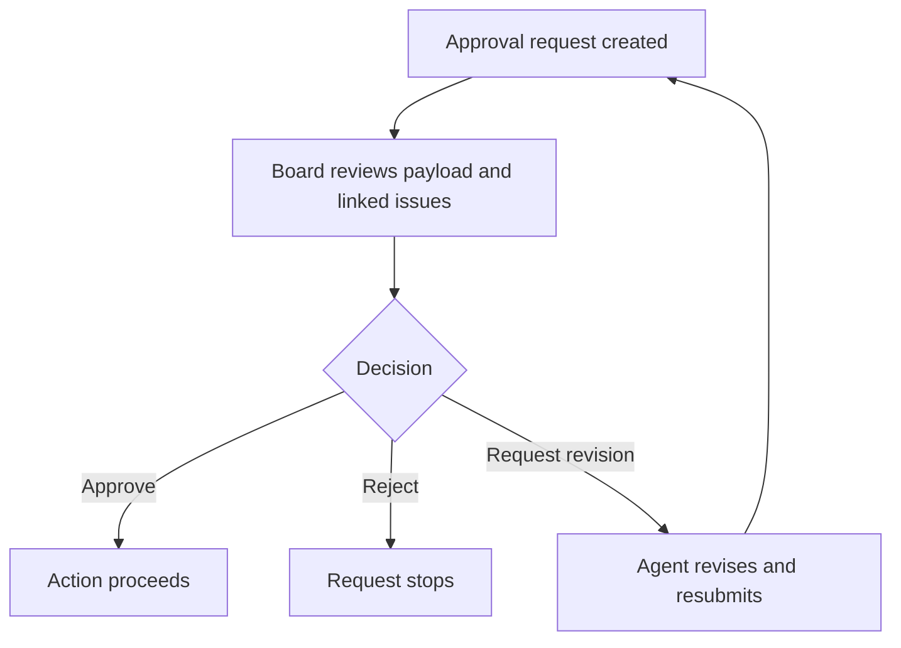

Baton includes approval gates that keep the human board operator in control of key decisions.

## Approval Flow at a Glance



## Approval Types

| Approval | When it appears | What approval unlocks | Notes |
|----------|-----------------|-----------------------|-------|
| `hire_agent` | a manager or CEO wants to hire a subordinate | creates or activates the requested agent | payload includes name, role, capabilities, adapter config, and budget |
| `approve_ceo_strategy` | the CEO submits an initial strategic plan | the CEO can continue with governed execution | this is the first board sign-off on company direction |
| `approve_issue_plan` | a leader is ready to move delegated implementation into a ticket workspace | Baton provisions the ticket execution workspace and unblocks child implementation work | can be force-approved only when the board intentionally accepts a dirty source checkout |
| `approve_pull_request` | child reviews are complete | Baton commits, pushes, opens the PR, and finalizes the parent issue | closes any still-open child issues under the completed parent |

## Reviewing an Approval

1. Open the approval from the **Approvals** page.
2. Inspect the payload and any linked issues.
3. Read the comments and decision note before acting.
4. Choose one of three actions:
   - **Approve** — the action proceeds
   - **Reject** — the action stops
   - **Request revision** — the agent updates the work and resubmits

When you request revision on a governed issue approval, Baton comments on linked issues, wakes the requesting agent, and moves linked work back to `in_progress` so the agent can rework it.

## Approval Workflow

```text
pending -> approved
        -> rejected
        -> cancelled
        -> revision_requested

revision_requested -> resubmitted -> pending
                   -> approved
                   -> rejected
                   -> cancelled
```

## Force Approve

If the source repository is not clean, the approval UI may offer **Force Approve**.

Use it sparingly. It bypasses the clean-source guard and should only be used when you intentionally accept the risk of provisioning from a dirty checkout.

Force approve is only relevant for `approve_issue_plan`.

For the default project workflow, see [Governed Ticket Execution](./default-governed-workflow).

## Reviewing Approvals

From the Approvals page, you can see all pending approvals. Each approval shows:

- Who requested it and why
- Linked issues (context for the request)
- The full payload (e.g. proposed agent config for hires)
- Comments and board feedback

The approval detail page also supports:

- revision requests with notes
- resubmission after agent changes
- force approve when a plan approval is blocked by a dirty source repo

## Board Override Powers

As the board operator, you can also:

- Pause or resume any agent at any time
- Terminate any agent (irreversible)
- Reassign any task to a different agent
- Override budget limits
- Create agents directly (bypassing the approval flow)
