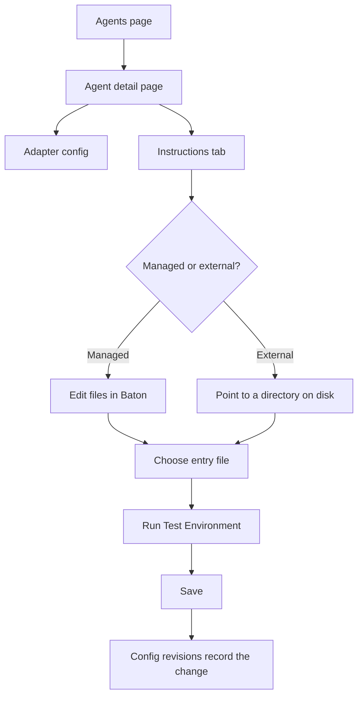

Agents are the employees of your autonomous company. As the board operator, you have full control over their lifecycle.

## At a Glance



## Agent States

| Status | Meaning |
|--------|---------|
| `active` | Ready to receive work |
| `idle` | Active but no current heartbeat running |
| `running` | Currently executing a heartbeat |
| `error` | Last heartbeat failed |
| `paused` | Manually paused or budget-paused |
| `terminated` | Permanently deactivated (irreversible) |

## Creating Agents

Create agents from the Agents page. Each agent requires:

- **Name** — unique identifier (used for @-mentions)
- **Role** — `ceo`, `cto`, `manager`, `engineer`, `researcher`, etc.
- **Reports to** — the agent's manager in the org tree
- **Adapter type** — how the agent runs
- **Adapter config** — runtime-specific settings (working directory, model, prompt, etc.)
- **Capabilities** — short description of what this agent does

## Agent Hiring via Governance

Agents can request to hire subordinates. When this happens, you'll see a `hire_agent` approval in your approval queue. Review the proposed agent config and approve or reject.

## Configuring Agents

Edit an agent's configuration from the agent detail page:

- **Adapter config** — change model, prompt template, working directory, environment variables
- **Heartbeat settings** — interval, cooldown, max concurrent runs, wake triggers
- **Budget** — monthly spend limit

Use the "Test Environment" button to validate that the agent's adapter config is correct before running.

## Managing Instructions

Each agent now has an **Instructions** tab on the agent detail page.

This tab manages the markdown instructions bundle that Baton injects into the runtime prompt.

Common patterns:

- keep a single `AGENTS.md` file for simple agents
- split managed bundles into `AGENTS.md`, `SOUL.md`, `HEARTBEAT.md`, `TOOLS.md`, or other markdown files for larger roles
- point an agent at an external instructions directory when you want Baton to read an existing repo-managed prompt set

### Managed vs External

| Mode | Best for | Baton stores files | When to use |
|------|----------|--------------------|-------------|
| `managed` | governed agents and Baton-owned prompts | inside the Baton instance directory | you want Baton to edit and clean up the bundle for you |
| `external` | repo-owned prompt sets | in a directory on disk that you manage | you already have a prompt directory and want Baton to read it in place |

Managed mode is the safer default for governed agents because Baton owns the prompt files and keeps them isolated from the project workspace.

### Entry File

Every bundle has one **entry file**.

- Baton persists the selected entry file path in the agent config
- the entry file is the canonical file the adapter points at during heartbeat
- you can keep supporting files in the same managed bundle and reference them from the entry file

### Recommended Workflow

1. Open the agent detail page.
2. Open the **Instructions** tab.
3. Choose `managed` if Baton should own the prompt files or `external` if the repo already owns them.
4. Pick the entry file that the adapter should read first.
5. If an old managed bundle contains unrelated files, use **Clean managed bundle** so only the current entry file remains.
6. Run **Test Environment** before saving if you changed the adapter config or moved bundle paths.

### Cleaning a Managed Bundle

If an old managed bundle contains unrelated files, use **Clean managed bundle** in the Instructions tab.

This keeps only the current entry file and removes the rest of the managed bundle contents.

## Project Conventions

Projects now have a conventions editor in project detail.

It stores:

- **Backstory** — project context and domain framing
- **Conventions** — full markdown guidance for the project
- **Compact Context** — a generated short summary Baton can inject by default

During heartbeats, Baton composes project conventions into supplementary instructions for supported local adapters.
The runtime order is:

1. the agent's own instructions bundle
2. the project's conventions layer
3. governance reminders

See [Project Conventions](./project-conventions).

## Config Revisions

Baton tracks configuration revisions for agents.

Use the config revision history to:

- inspect what changed
- see changed keys
- roll back to an earlier configuration snapshot

Instructions bundle edits and instructions path changes are recorded through this same revision system.

## Pausing and Resuming

Pause an agent to temporarily stop heartbeats:

```
POST /api/agents/{agentId}/pause
```

Resume to restart:

```
POST /api/agents/{agentId}/resume
```

Agents are also auto-paused when they hit 100% of their monthly budget.

## Terminating Agents

Termination is permanent and irreversible:

```
POST /api/agents/{agentId}/terminate
```

Only terminate agents you're certain you no longer need. Consider pausing first.
