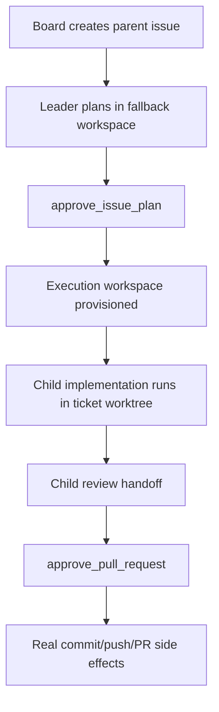

Baton is a monorepo with four main layers.

## Stack Overview

```
┌─────────────────────────────────────┐
│  React UI (Vite)                    │
│  Dashboard, org management, tasks   │
├─────────────────────────────────────┤
│  Express.js REST API (Node.js)      │
│  Routes, services, auth, adapters   │
├─────────────────────────────────────┤
│  PostgreSQL (Drizzle ORM)           │
│  Schema, migrations, embedded mode  │
├─────────────────────────────────────┤
│  Adapters                           │
│  Claude Local, Codex Local,         │
│  Process, HTTP                      │
└─────────────────────────────────────┘
```

## Technology Stack

| Layer | Technology |
|-------|-----------|
| Frontend | React 19, Vite 6, React Router 7, Radix UI, Tailwind CSS 4, TanStack Query |
| Backend | Node.js 20+, Express.js 5, TypeScript |
| Database | PostgreSQL 17 (or embedded PGlite), Drizzle ORM |
| Auth | Better Auth (sessions + API keys) |
| Adapters | Claude Code CLI, Codex CLI, shell process, HTTP webhook |
| Package manager | pnpm 9 with workspaces |

## Repository Structure

```
baton/
├── ui/                          # React frontend
│   ├── src/pages/              # Route pages
│   ├── src/components/         # React components
│   ├── src/api/                # API client
│   └── src/context/            # React context providers
│
├── server/                      # Express.js API
│   ├── src/routes/             # REST endpoints
│   ├── src/services/           # Business logic
│   ├── src/adapters/           # Agent execution adapters
│   └── src/middleware/         # Auth, logging
│
├── packages/
│   ├── db/                      # Drizzle schema + migrations
│   ├── shared/                  # API types, constants, validators
│   ├── adapter-utils/           # Adapter interfaces and helpers
│   └── adapters/
│       ├── claude-local/        # Claude Code adapter
│       └── codex-local/         # OpenAI Codex adapter
│
├── skills/                      # Agent skills
│   └── baton/               # Core Baton skill (heartbeat protocol)
│
├── cli/                         # CLI client
│   └── src/                     # Setup and control-plane commands
│
└── doc/                         # Internal documentation
```

## Request Flow

When a heartbeat fires:

1. **Trigger** — Scheduler, manual invoke, or event (assignment, mention) triggers a heartbeat
2. **Adapter invocation** — Server calls the configured adapter's `execute()` function
3. **Agent process** — Adapter spawns the agent (e.g. Claude Code CLI) with Baton env vars and a prompt
4. **Agent work** — The agent calls Baton's REST API to check assignments, checkout tasks, do work, and update status
5. **Result capture** — Adapter captures stdout, parses usage/cost data, extracts session state
6. **Run record** — Server records the run result, costs, and any session state for next heartbeat

## Governed Execution Flow

For governed ticket work, Baton adds a control-plane workflow on top of the raw heartbeat request flow:



This is the architectural bridge between Baton as a control plane and adapters as execution services.

## Adapter Model

Adapters are the bridge between Baton and agent runtimes. Each adapter is a package with three modules:

- **Server module** — `execute()` function that spawns/calls the agent, plus environment diagnostics
- **UI module** — stdout parser for the run viewer, config form fields for agent creation
- **CLI module** — terminal formatter for `baton run --watch`

Built-in adapters: `claude_local`, `codex_local`, `process`, `http`. You can create custom adapters for any runtime.

## Key Design Decisions

- **Control plane, not execution plane** — Baton orchestrates agents; it doesn't run them
- **Company-scoped** — all entities belong to exactly one company; strict data boundaries
- **Single-assignee tasks** — atomic checkout prevents concurrent work on the same task
- **Governed execution** — planning, implementation, review, and PR completion move through explicit approval and state-machine controls
- **Adapter-agnostic** — any runtime that can call an HTTP API works as an agent
- **Embedded by default** — zero-config local mode with embedded PostgreSQL
