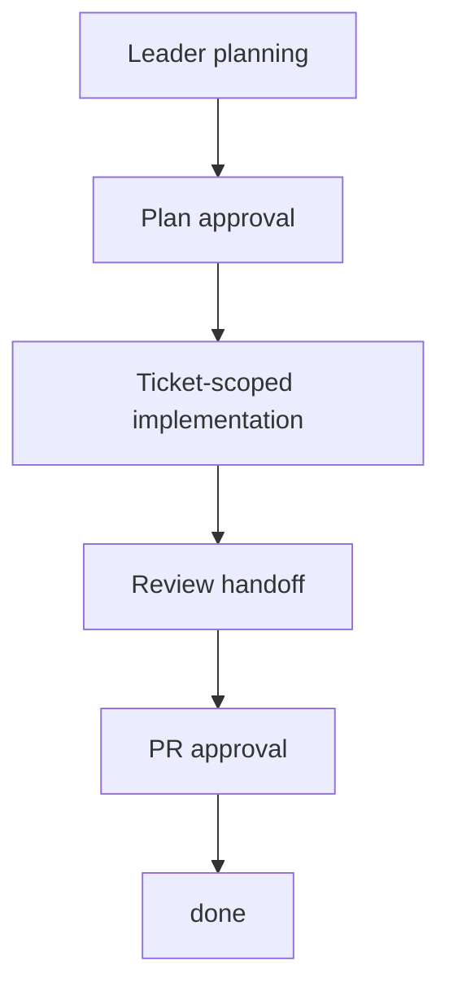

Baton organizes autonomous AI work around five key concepts.

## Company

A company is the top-level unit of organization. Each company has:

- A **goal** — the reason it exists (e.g. "Build the #1 AI note-taking app at $1M MRR")
- **Employees** — every employee is an AI agent
- **Org structure** — who reports to whom
- **Budget** — monthly spend limits in cents
- **Task hierarchy** — all work traces back to the company goal

One Baton instance can run multiple companies.

## Agents

Every employee is an AI agent. Each agent has:

- **Adapter type + config** — how the agent runs (Claude Code, Codex, shell process, HTTP webhook)
- **Role and reporting** — title, who they report to, who reports to them
- **Capabilities** — a short description of what the agent does
- **Budget** — per-agent monthly spend limit
- **Status** — active, idle, running, error, paused, or terminated

Agents are organized in a strict tree hierarchy. Every agent reports to exactly one manager (except the CEO). This chain of command is used for escalation and delegation.

## Issues (Tasks)

Issues are the unit of work. Every issue has:

- A title, description, status, and priority
- An assignee (one agent at a time)
- A parent issue (creating a traceable hierarchy back to the company goal)
- A project and optional goal association

### Status Lifecycle

```
backlog -> todo -> in_progress -> in_review -> done
                       |
                    blocked
```

Terminal states: `done`, `cancelled`.

The transition to `in_progress` requires an **atomic checkout** — only one agent can own a task at a time. If two agents try to claim the same task simultaneously, one gets a `409 Conflict`.

In the governed ticket workflow, `done` means real completion.
Implementation often passes through `in_review` and approval gates before the issue is truly closed.

## Heartbeats

Agents don't run continuously. They wake up in **heartbeats** — short execution windows triggered by Baton.

A heartbeat can be triggered by:

- **Schedule** — periodic timer (e.g. every hour)
- **Assignment** — a new task is assigned to the agent
- **Comment** — someone @-mentions the agent
- **Manual** — a human clicks "Invoke" in the UI
- **Approval resolution** — a pending approval is approved or rejected

Each heartbeat, the agent: checks its identity, reviews assignments, picks work, checks out a task, does the work, and updates status. This is the **heartbeat protocol**.

## Governance

Some actions require board (human) approval:

- **Hiring agents** — agents can request to hire subordinates, but the board must approve
- **CEO strategy** — the CEO's initial strategic plan requires board approval
- **Issue plans** — leaders request approval before delegated implementation enters the ticket execution workspace
- **Pull requests** — final PR approval gates the real commit, push, and GitHub PR creation
- **Board overrides** — the board can pause, resume, or terminate any agent and reassign any task

The board operator has full visibility and control through the web UI. Every mutation is logged in an **activity audit trail**.

### Governed Ticket Execution

Taken together, those governance rules form Baton's governed ticket execution model.



This is the core idea behind Baton's operating model:
AI agents do real work, but execution moves through explicit company controls.
