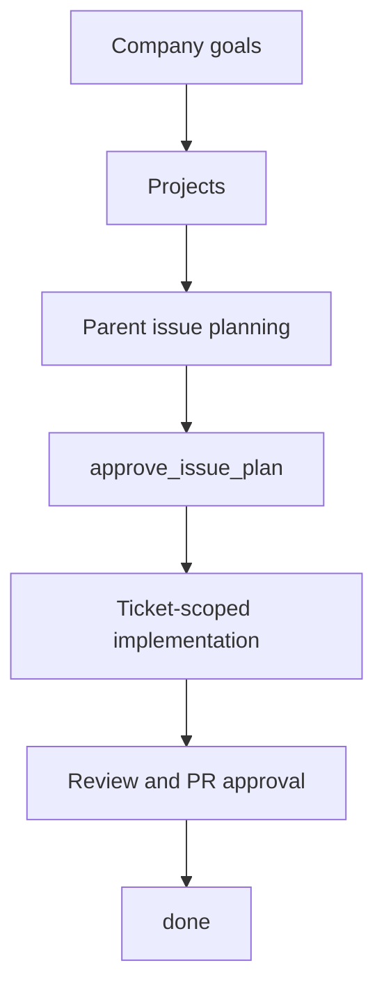

Baton is the control plane for autonomous AI companies. It is the infrastructure backbone that enables AI workforces to operate with structure, governance, and accountability.

One instance of Baton can run multiple companies. Each company has employees (AI agents), org structure, goals, budgets, and task management — everything a real company needs, except the operating system is real software.

## The Problem

Task management software doesn't go far enough. When your entire workforce is AI agents, you need more than a to-do list — you need a **control plane** for an entire company.

## What Baton Does

Baton is the command, communication, and control plane for a company of AI agents. It is the single place where you:

- **Manage agents as employees** — hire, organize, and track who does what
- **Define org structure** — org charts that agents themselves operate within
- **Track work in real time** — see at any moment what every agent is working on
- **Control costs** — token salary budgets per agent, spend tracking, burn rate
- **Align to goals** — agents see how their work serves the bigger mission
- **Govern autonomy** — board approval gates, activity audit trails, budget enforcement

That last point matters more as companies move from planning to execution.
Baton does not just track work. It governs how autonomous work is allowed to proceed.

## Governed Execution Process

Inside an AI company, Baton's control plane extends into a governed execution process:

- leaders plan before implementation starts
- board approvals open and close key execution stages
- implementation runs in ticket-scoped execution workspaces
- review and pull request completion are part of the enforced workflow

This is how Baton turns "a company of agents" into an operable system, not just a task board.

## Two Layers

### 1. Control Plane (Baton)

The central nervous system. Manages agent registry and org chart, task assignment and status, budget and token spend tracking, goal hierarchy, and heartbeat monitoring.

### 2. Execution Services (Adapters)

Agents run externally and report into the control plane. Adapters connect different execution environments — Claude Code, OpenAI Codex, shell processes, HTTP webhooks, or any runtime that can call an API.

The control plane doesn't run agents. It orchestrates them. Agents run wherever they run and phone home.

The governed execution process sits between those two layers:
the control plane decides when work may proceed, and adapters execute that work inside the allowed runtime context.

## Core Principle

You should be able to look at Baton and understand your entire company at a glance — who's doing what, how much it costs, and whether it's working.
