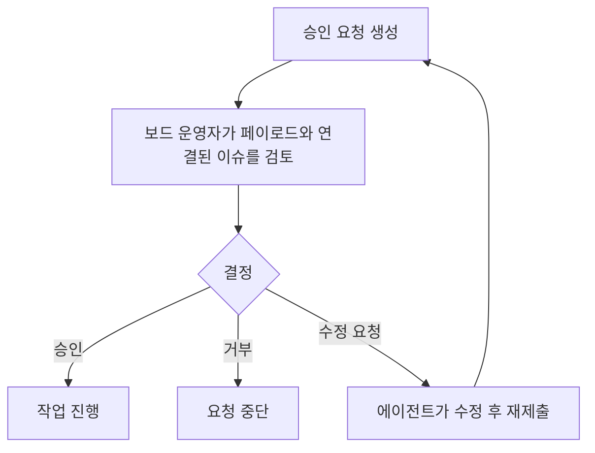

import { AnnotatedScreenshot } from "@site/src/components/docs";

Baton에는 사람 보드 운영자가 주요 의사 결정을 통제할 수 있도록 하는 승인 게이트가 포함되어 있습니다.

## 승인 흐름 한눈에 보기



<AnnotatedScreenshot
  title="결정하기 전에 먼저 읽으세요"
  description="승인 페이지에는 요청 유형, payload 요약, 연결된 작업이 한곳에 모여 있습니다."
  imageSrc="/img/screenshots/approvals.png"
  imageAlt="완료된 승인 기록, payload 요약, 연결 이슈 맥락이 함께 보이는 승인 화면"
  imageCaption="요청 유형을 먼저 읽고, 그다음 연결 이슈를 확인한 뒤 결정을 내리세요."
  callouts={[
    {
      title: "승인 유형",
      description: "채용, 전략, 이슈 계획, PR 승인 중 무엇인지 먼저 확인합니다.",
      tone: "primary",
    },
    {
      title: "연결된 이슈",
      description: "결정이 현재 워크플로우 맥락과 맞는지 관련 작업을 확인합니다.",
      tone: "success",
    },
    {
      title: "결정 컨트롤",
      description: "위험을 이해한 경우에만 승인, 거부, 수정 요청, 강제 승인을 사용합니다.",
      tone: "warning",
    },
  ]}
/>

## 승인 유형

| 승인 | 언제 보이는가 | 승인 시 무엇이 열리는가 | 메모 |
|------|---------------|-------------------------|------|
| `hire_agent` | 매니저나 CEO가 부하 직원 채용을 원할 때 | 요청된 에이전트가 생성되거나 활성화됨 | 이름, 역할, 역량, 어댑터 설정, 예산이 payload에 포함됨 |
| `approve_ceo_strategy` | CEO가 첫 전략 계획을 제출할 때 | CEO가 거버넌스 기반 실행을 계속할 수 있음 | 회사 방향에 대한 첫 보드 승인 |
| `approve_issue_plan` | 리더가 위임된 구현을 티켓 작업공간으로 옮기려 할 때 | Baton이 티켓 실행 작업공간을 준비하고 child 구현을 열어줌 | source checkout이 dirty일 때만 의도적으로 강제 승인할 수 있음 |
| `approve_pull_request` | child 리뷰가 끝났을 때 | Baton이 commit, push, PR 생성, parent 마감을 수행함 | 완료된 parent 아래 아직 열려 있는 child 이슈도 함께 닫힘 |

## 승인 검토

1. **승인** 페이지에서 승인을 엽니다.
2. payload와 연결된 이슈를 검토합니다.
3. 코멘트와 결정 메모를 읽은 뒤 행동합니다.
4. 다음 중 하나를 선택합니다:
   - **승인** — 작업이 진행됩니다
   - **거부** — 작업이 중단됩니다
   - **수정 요청** — 에이전트가 수정 후 재제출합니다

거버넌스 기반 이슈 승인에 수정 요청을 하면 Baton은 연결된 이슈에 코멘트를 남기고, 요청한 에이전트를 깨우며, 연결된 작업을 다시 `in_progress`로 되돌려 재작업할 수 있게 합니다.

## 승인 워크플로

```text
pending -> approved
        -> rejected
        -> cancelled
        -> revision_requested

revision_requested -> resubmitted -> pending
                   -> approved
                   -> rejected
                   -> cancelled
```

## 강제 승인

source repository가 clean하지 않으면 승인 UI에 **강제 승인**이 표시될 수 있습니다.

이 옵션은 신중하게 사용해야 합니다. clean-source guard를 우회하므로 dirty checkout에서 실행 작업공간을 준비하는 위험을 의도적으로 감수할 때만 사용하십시오.

강제 승인은 `approve_issue_plan`에만 해당합니다.

기본 프로젝트 흐름은 [거버넌스 기반 티켓 실행 흐름](./default-governed-workflow) 문서를 참고하세요.

## 승인 검토 화면

승인 페이지에서 모든 대기 중인 승인을 확인할 수 있습니다. 각 승인에는 다음이 표시됩니다:

- 누가 요청했으며 왜 요청했는지
- 연결된 이슈 (요청에 대한 맥락)
- 전체 payload (예: 채용에 대한 제안된 에이전트 설정)
- 코멘트와 보드 피드백

승인 상세 페이지에서는 다음도 지원합니다:

- 메모를 포함한 수정 요청
- 에이전트 변경 후 재제출
- dirty source repo 때문에 계획 승인이 막힐 때의 강제 승인

## Board 재정 권한

보드 운영자로서 다음 작업도 수행할 수 있습니다:

- 언제든지 에이전트를 일시 중지하거나 재개
- 에이전트를 종료 (되돌릴 수 없음)
- 다른 에이전트에게 태스크 재할당
- 예산 한도 재정의
- 에이전트를 직접 생성 (승인 흐름 우회)
