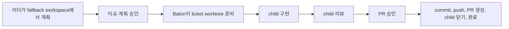

이 가이드는 리더가 구현 작업을 위임할 때 Baton이 사용하는 기본 프로젝트 워크플로우를 설명합니다.
이 흐름은 승인 게이트를 포함한 티켓 단위 실행 모델입니다.

## Baton이 지금 하는 일

Baton은 계획과 구현을 분리합니다.
리더는 fallback workspace에서 계획합니다.
승인된 구현은 티켓 단위 execution workspace에서 실행됩니다.
리뷰와 PR 승인은 권장 사항이 아니라 실제로 강제되는 워크플로우입니다.

## 흐름 한눈에 보기



## 기본 흐름

1. Board Operator가 최상위 이슈를 만들고 리더 에이전트에게 할당합니다.
2. 리더는 fallback workspace에서 계획을 수립합니다.
3. 리더가 **이슈 계획 승인**을 요청합니다.
4. Baton이 parent 이슈를 `blocked`로 전환합니다.
5. Board가 계획을 승인하면 Baton이 티켓당 execution workspace 하나를 준비합니다.
   - 브랜치: `feature/<TICKET>`
   - 베이스 브랜치: 프로젝트 workspace의 기본 베이스 브랜치
   - 실행 경로: Baton이 관리하는 git worktree
6. parent 이슈가 재개되고 리더가 child 구현 이슈를 만듭니다.
7. 구현 에이전트는 티켓 execution workspace 안에서 작업합니다.
8. 구현이 끝나면 Baton은 child를 `in_review`로 바꾸고 리뷰어에게 넘깁니다.
9. 모든 child 리뷰가 끝나면 Baton이 parent를 `in_review`로 전환하고 **PR 승인**을 생성합니다.
10. Board가 PR 요청을 승인하면 Baton이 commit, push, 실제 PR 생성과 함께 그 parent에 남아 있는 child 이슈들을 cascade completion 처리한 뒤 parent를 `done`으로 마감합니다.

## 누가 무엇을 하는가

| 역할 | 책임 |
|------|------|
| Board Operator | 계획과 최종 PR을 승인하고, 필요할 때 위험한 실행을 override |
| 리더 | 작업을 계획하고 child 이슈를 만들고 child 작업을 리뷰 |
| Baton | 티켓 workspace를 준비하고, 상태를 옮기고, child 이슈를 dedupe하고, PR 흐름을 마무리 |

## 핵심 규칙

- 계획은 리더 fallback workspace에서 수행됩니다
- 승인된 구현은 티켓 execution workspace에서 수행됩니다
- source repo는 설정된 base branch에 유지됩니다
- 서로 다른 티켓은 서로 다른 worktree에서 병렬 실행할 수 있습니다
- 코드 실행의 격리 단위는 티켓입니다

## 상태 의미

- `todo`: 시작 준비 완료
- `in_progress`: 실제 작업 진행 중
- `blocked`: 승인, 입력, 외부 의존성 등을 기다리는 상태
- `in_review`: 구현은 리뷰어나 board에 넘길 만큼 완료됐지만 워크플로우는 아직 끝나지 않은 상태
- `done`: PR 승인까지 포함한 거버넌스 기반 워크플로우가 실제로 완료된 상태

## 병렬 티켓 예시

```text
source repo: azak (base branch: main)

AZAK-010 -> execution workspace -> feature/AZAK-010 -> child work -> review -> PR approval
AZAK-011 -> execution workspace -> feature/AZAK-011 -> child work -> review -> PR approval

두 티켓은 병렬로 진행되지만, 각 티켓은 자기 branch와 runtime cwd를 따로 가집니다.
```

## 워크스페이스 규칙

- 최상위 계획 작업은 source repo에서 직접 실행하지 않습니다.
- 승인된 구현도 공유 source repo에서 직접 실행하지 않습니다.
- Baton은 티켓마다 execution workspace 하나를 만들고 source repo는 설정된 base branch에 유지합니다.
- 서로 다른 티켓은 서로 다른 worktree에서 병렬 실행할 수 있습니다.
- 코드 실행의 격리 단위는 티켓입니다.
- 연결된 execution workspace가 없거나 깨지면 경고와 함께 임시 fallback 이 일어날 수 있습니다. 이것은 정상 경로가 아니라 거버넌스 기반 흐름의 degraded path 입니다.

## 기본 리뷰어 동작

현재 기본 동작은 다음과 같습니다.

- reviewer = parent issue assignee agent

즉 일반적인 구성에서는 리더가 기본 리뷰어가 됩니다.

## 에이전트 구성 예시

### 리더 + 구현 에이전트

현재 Baton이 가장 잘 지원하는 기본 구성입니다.

- 리더가 계획 수립 및 위임
- 구현 에이전트가 child 작업 수행
- 리더가 child 리뷰
- Board가 PR 승인

### 리더 + 전용 리뷰어

개념적으로는 가능하지만, 현재 Baton은 정책 기반 리뷰어 선택을 기본으로 사용하지 않습니다.

전용 리뷰어를 기본값으로 두고 싶다면, 제목 규칙이나 프롬프트가 아니라 workflow policy 기능으로 넣는 것이 맞습니다.

## Baton이 Child 중복 생성을 막는 이유

리더 run은 retry 또는 resume 될 수 있습니다. 그래서 같은 child 생성 요청이 한 번 이상 들어올 수 있습니다.

Baton은 활성 child를 다음 기준으로 dedupe 합니다.

- parent
- assignee
- delegation metadata (`kind` + `key`)가 있으면 그것

delegation metadata가 없으면 정규화된 title 비교로 fallback 합니다.

종료된 child 이슈(`done`, `cancelled`)는 같은 delegation key의 후속 작업을 막지 않습니다.

## 이 워크플로우의 승인 유형

### 이슈 계획 승인

구현을 시작하기 전에 사용합니다.

- pending 동안 parent를 막음
- execution workspace 계획을 담음
- 승인 시 티켓 worktree를 준비함
- board가 clean-source guard를 의도적으로 우회하지 않는 한 source repository가 clean해야 할 수 있음

### PR 승인

child 리뷰가 끝난 뒤 사용합니다.

- pending 동안 parent를 `in_review`에 유지
- 승인 시 실제 commit, push, pull request 생성을 수행
- 최종 마감 과정에서 완료된 parent 아래 남아 있는 child 이슈들을 닫음

## 실무 체크 포인트

계획 승인 전에는 다음을 확인합니다.

- ticket key
- branch name
- base branch
- project workspace
- repo path
- source checkout이 clean한지 여부

PR 승인 전에는 다음을 확인합니다.

- child 리뷰 완료 여부
- PR 브랜치가 parent 티켓과 일치하는지
- 생성된 PR 본문이 실제 변경 내용을 제대로 요약하는지
- 어떤 parent를 마감하려는 승인인지, 남아 있는 child 이슈가 함께 닫혀도 되는지
