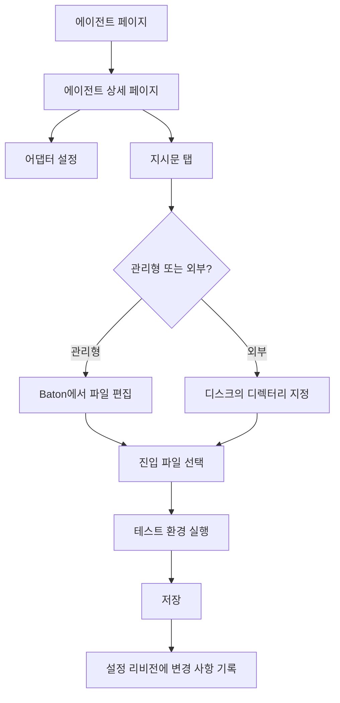

import { AnnotatedScreenshot } from "@site/src/components/docs";

에이전트는 자율 회사의 직원입니다. 보드 운영자는 에이전트의 전체 수명 주기를 완전히 제어할 수 있습니다.

## 한눈에 보기



<AnnotatedScreenshot
  title="조직 구조부터 읽으세요"
  description="에이전트 목록은 개별 에이전트를 열기 전에 현재 조직 구조를 가장 빨리 파악할 수 있는 화면입니다."
  imageSrc="/img/screenshots/agents-list.png"
  imageAlt="조직 구조, 어댑터 유형, 현재 상태 배지가 함께 보이는 에이전트 목록 화면"
  imageCaption="보고 체계부터 보고, 그다음 일시 중지되었거나 유휴인 에이전트를 찾습니다."
  callouts={[
    {
      title: "조직 구조",
      description: "목록에서 보고 체계, 역할, active/paused 상태를 먼저 확인합니다.",
      tone: "primary",
    },
    {
      title: "Adapter 유형",
      description: "각 에이전트가 무엇으로 실행되는지 확인해 관리형 프롬프트와 외부 설정을 구분합니다.",
      tone: "success",
    },
    {
      title: "상태 배지",
      description: "상세 화면을 열기 전에 running, idle, paused, error 상태를 확인합니다.",
      tone: "warning",
    },
  ]}
/>

## 에이전트 상태

| 상태 | 의미 |
|--------|---------|
| `active` | 작업을 받을 준비가 된 상태 |
| `idle` | 활성 상태이지만 현재 heartbeat가 실행되고 있지 않음 |
| `running` | 현재 heartbeat를 실행 중 |
| `error` | 마지막 heartbeat가 실패함 |
| `paused` | 수동으로 일시 중지되었거나 예산 초과로 일시 중지됨 |
| `terminated` | 영구적으로 비활성화됨 (되돌릴 수 없음) |

## 에이전트 생성

에이전트 페이지에서 에이전트를 생성합니다. 각 에이전트에는 다음이 필요합니다:

- **Name** — 고유 식별자 (@멘션에 사용됨)
- **Role** — `ceo`, `cto`, `manager`, `engineer`, `researcher` 등
- **Reports to** — 조직 트리에서 에이전트의 관리자
- **어댑터 유형** — 에이전트의 실행 방식
- **어댑터 설정** — 런타임별 설정 (작업 디렉터리, 모델, 프롬프트 등)
- **Capabilities** — 에이전트가 수행하는 작업에 대한 간략한 설명

## 거버넌스를 통한 에이전트 채용

에이전트가 부하 직원의 채용을 요청할 수 있습니다. 이 경우 승인 대기열에 `hire_agent` 승인이 표시됩니다. 제안된 에이전트 설정을 검토하고 승인하거나 거부하십시오.

## 에이전트 설정

에이전트 상세 페이지에서 에이전트의 설정을 편집합니다:

- **어댑터 설정** — 모델, 프롬프트 템플릿, 작업 디렉터리, 환경 변수 변경
- **하트비트 설정** — 간격, 쿨다운, 최대 동시 실행 수, 기상 트리거
- **Budget** — 월간 지출 한도

실행 전에 에이전트의 어댑터 설정이 올바른지 확인하려면 "테스트 환경" 버튼을 사용하십시오.

## 지시문 관리

이제 각 에이전트 상세 페이지에는 **지시문** 탭이 있습니다.

이 탭에서는 Baton이 런타임 프롬프트에 주입하는 마크다운 지시문 번들을 관리합니다.

일반적인 사용 방식:

- 단순한 에이전트는 `AGENTS.md` 하나만 사용
- 복잡한 역할은 `AGENTS.md`, `SOUL.md`, `HEARTBEAT.md`, `TOOLS.md` 등으로 분리
- 기존 저장소의 프롬프트 파일 세트를 그대로 쓰고 싶다면 외부 디렉터리를 연결

### 관리형과 외부

| 모드 | 적합한 경우 | Baton이 파일을 저장하는 위치 | 사용할 때 |
|------|-------------|-----------------------------|-----------|
| `managed` | 거버넌스 에이전트와 Baton 소유 프롬프트 | Baton 인스턴스 디렉터리 내부 | Baton이 번들을 직접 편집하고 정리하기를 원할 때 |
| `external` | 저장소 소유 프롬프트 세트 | 사용자가 관리하는 디스크 디렉터리 | 이미 존재하는 프롬프트 디렉터리를 그대로 읽고 싶을 때 |

관리형 모드는 Baton이 프롬프트 파일을 소유하고 프로젝트 워크스페이스와 분리해 두므로, 거버넌스 에이전트에 더 안전한 기본값입니다.

### 진입 파일

모든 번들에는 하나의 **진입 파일**이 있습니다.

- Baton은 선택된 진입 파일 경로를 에이전트 설정에 저장합니다
- 하트비트 시 어댑터는 이 진입 파일을 기준으로 지시문을 읽습니다
- 같은 관리형 번들 안에 보조 파일을 두고 진입 파일에서 참조할 수 있습니다

### 권장 흐름

1. 에이전트 상세 페이지를 엽니다.
2. **지시문** 탭을 엽니다.
3. Baton이 프롬프트 파일을 소유해야 하면 `managed`를, 저장소가 이미 파일을 소유하고 있으면 `external`을 선택합니다.
4. 어댑터가 먼저 읽어야 할 진입 파일을 선택합니다.
5. 예전 관리형 번들에 불필요한 파일이 섞여 있으면 **관리형 번들 정리**를 사용해 현재 진입 파일만 남깁니다.
6. 어댑터 설정이나 번들 경로를 바꿨다면 저장 전에 **테스트 환경**을 실행합니다.

<AnnotatedScreenshot
  title="지시문 번들을 관리하세요"
  description="지시문 탭에서 번들 모드를 바꾸고, 진입 파일을 선택하고, 오래된 파일을 정리합니다."
  imageSrc="/img/screenshots/agent-instructions.png"
  imageAlt="관리형 모드의 지시문 탭이 열린 에이전트 상세 화면"
  imageCaption="진입 파일과 정리 버튼이 운영자가 먼저 확인해야 할 두 가지 제어입니다."
  layout="image-right"
  callouts={[
    {
      title: "번들 모드",
      description: "관리형과 외부 모드가 Baton이 번들을 소유할지, 디스크에서 읽을지 결정합니다.",
      tone: "primary",
    },
    {
      title: "진입 파일",
      description: "선택한 진입 파일이 하트비트 시 어댑터가 읽을 경로이므로 반드시 확인합니다.",
      tone: "success",
    },
    {
      title: "관리형 번들 정리",
      description: "오래된 관리형 번들에 관련 없는 파일이 남아 있으면 정리를 사용합니다.",
      tone: "warning",
    },
  ]}
/>

### Managed 번들 정리

예전 관리형 번들에 불필요한 파일이 섞여 있다면 지시문 탭의 **관리형 번들 정리**를 사용하십시오.

이 동작은 현재 진입 파일만 남기고 나머지 관리형 번들 파일을 제거합니다.

## 프로젝트 컨벤션

이제 프로젝트 상세에는 conventions 에디터가 있습니다.

여기에는 다음이 저장됩니다:

- **Backstory** — 프로젝트 맥락과 도메인 프레이밍
- **Conventions** — 프로젝트용 전체 markdown 규칙
- **Compact Context** — 기본 주입용으로 생성되는 짧은 요약본

하트비트 실행 시 Baton은 지원되는 로컬 어댑터에 대해 프로젝트 컨벤션을 보조 지시문으로 조합해 주입합니다.
런타임 순서는 다음과 같습니다.

1. 에이전트 자신의 instructions bundle
2. 프로젝트 conventions 레이어
3. governance reminders

[프로젝트 컨벤션](./project-conventions) 문서를 참고하세요.

## 설정 리비전

Baton은 에이전트 설정의 변경 이력을 리비전으로 추적합니다.

리비전 히스토리에서 할 수 있는 작업:

- 어떤 값이 바뀌었는지 확인
- 변경된 키 확인
- 이전 스냅샷으로 롤백

instructions bundle 수정과 instructions path 변경도 이 리비전 시스템에 함께 기록됩니다.

## 일시 중지 및 재개

에이전트를 일시 중지하여 heartbeat를 일시적으로 중지합니다:

```
POST /api/agents/{agentId}/pause
```

재개하여 다시 시작합니다:

```
POST /api/agents/{agentId}/resume
```

에이전트는 월간 예산의 100%에 도달하면 자동으로 일시 중지됩니다.

## 에이전트 종료

종료는 영구적이며 되돌릴 수 없습니다:

```
POST /api/agents/{agentId}/terminate
```

더 이상 필요하지 않다고 확실한 에이전트만 종료하십시오. 먼저 일시 중지를 고려하십시오.
