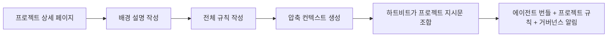

프로젝트 컨벤션은 모든 에이전트 프롬프트에 같은 규칙을 중복해서 넣지 않고도 Baton이 프로젝트별 컨텍스트를 실행 시 주입할 수 있게 합니다.

## 한눈에 보기




*컨벤션 탭은 프로젝트 수준의 컨텍스트를 Baton이 지원되는 실행에 재사용 가능한 레이어로 합성하는 지점입니다.*

## 저장되는 내용

각 프로젝트는 서로 관련된 세 개의 프롬프트 레이어를 저장할 수 있습니다:

- **배경 설명** — 프로젝트의 상위 맥락, 목표, 도메인 프레이밍
- **규칙** — 스택, 파일 구조, API 패턴, 리뷰 규칙 등을 담은 전체 마크다운 가이드
- **압축 컨텍스트** — 하트비트 때 기본적으로 주입할 수 있는 짧은 요약본

## 왜 필요한가

프로젝트 컨벤션은 에이전트 팀에서 자주 생기는 문제를 해결합니다:

- 에이전트 역할 프롬프트는 재사용 가능해야 합니다
- 프로젝트별 코딩 규칙은 프로젝트와 함께 관리되어야 합니다
- 런타임 프롬프트 크기는 제한되어야 합니다

프로젝트마다 긴 `AGENTS.md`를 다시 쓰는 대신 Baton은 다음을 조합합니다:

1. 에이전트 번들 지시문
2. 프로젝트 규칙 레이어
3. 거버넌스 알림

## 압축 컨텍스트

압축 컨텍스트는 프로젝트 컨벤션의 짧고 런타임 친화적인 버전입니다.

존재할 경우 Baton은 하트비트 주입 시 전체 규칙 마크다운보다 압축 컨텍스트를 우선 사용합니다.

이렇게 하면 전체 규칙 문서는 운영자가 편집과 참조를 위해 유지하면서도 토큰 사용량은 통제할 수 있습니다.

## 런타임에서의 사용 방식

지원되는 로컬 어댑터의 하트비트 실행 시 Baton은 다음을 조합한 보조 프로젝트 지시문을 만듭니다:

- 배경 설명
- 압축 컨텍스트가 있으면 그것, 없으면 전체 규칙
- 중요한 거버넌스 알림

이렇게 만들어진 조합 지시문은 에이전트 자신의 지시문 번들과 함께 주입됩니다.

## 일반적인 작업 흐름

1. 프로젝트 상세 페이지를 엽니다
2. 프로젝트 배경 설명을 작성하거나 붙여넣습니다
3. 전체 프로젝트 규칙을 마크다운으로 작성합니다
4. 압축 컨텍스트를 생성합니다
5. 전체 규칙이 실질적으로 바뀌면 압축 버전도 다시 생성합니다
6. 갱신된 압축 컨텍스트가 하트비트에서 사용되는지 확인합니다

## 에이전트 지시문과의 관계

프로젝트 컨벤션은 에이전트 지시문 번들을 대체하지 않습니다.

프로젝트 컨벤션에는 다음과 같은 공통 프로젝트 지식을 넣습니다:

- 기술 스택
- 아키텍처 규칙
- 디렉터리 구조
- 코딩 표준
- 도메인 용어

에이전트 번들에는 다음과 같은 역할별 동작을 넣습니다:

- 리더의 계획 수립 방식
- 리뷰어 규칙
- 구현 경계
- 도구 사용 패턴

## API 엔드포인트

```
GET /api/projects/{projectId}/conventions
PUT /api/projects/{projectId}/conventions
PATCH /api/projects/{projectId}/conventions
POST /api/projects/{projectId}/conventions/compact
```

엔드포인트 상세는 [Goals and Projects API](/api/goals-and-projects)를 참고하세요.
