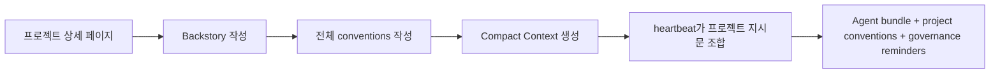

프로젝트 컨벤션은 모든 에이전트 프롬프트에 같은 규칙을 중복해서 넣지 않고도 Baton이 프로젝트별 컨텍스트를 실행 시 주입할 수 있게 합니다.

## 한눈에 보기



## 저장되는 내용

각 프로젝트는 서로 관련된 세 개의 프롬프트 레이어를 저장할 수 있습니다:

- **Backstory** — 프로젝트의 상위 맥락, 목표, 도메인 프레이밍
- **Conventions** — 스택, 파일 구조, API 패턴, 리뷰 규칙 등을 담은 전체 markdown 가이드
- **Compact Context** — heartbeat 때 기본적으로 주입할 수 있는 짧은 요약본

## 왜 필요한가

프로젝트 컨벤션은 에이전트 팀에서 자주 생기는 문제를 해결합니다:

- 에이전트 역할 프롬프트는 재사용 가능해야 합니다
- 프로젝트별 코딩 규칙은 프로젝트와 함께 관리되어야 합니다
- 런타임 프롬프트 크기는 제한되어야 합니다

프로젝트마다 긴 `AGENTS.md`를 다시 쓰는 대신 Baton은 다음을 조합합니다:

1. 에이전트 bundle instructions
2. 프로젝트 conventions 레이어
3. governance reminders

## Compact Context

Compact context는 프로젝트 컨벤션의 짧고 런타임 친화적인 버전입니다.

존재할 경우 Baton은 heartbeat 주입 시 전체 conventions markdown보다 compact context를 우선 사용합니다.

이렇게 하면 전체 conventions 문서는 운영자가 편집과 참조를 위해 유지하면서도 토큰 사용량은 통제할 수 있습니다.

## 런타임에서의 사용 방식

지원되는 로컬 adapter의 heartbeat 실행 시 Baton은 다음을 조합한 보조 프로젝트 지시문을 만듭니다:

- backstory
- compact context가 있으면 그것, 없으면 full conventions
- 중요한 governance reminders

이렇게 만들어진 composed instructions는 에이전트 자신의 instructions bundle과 함께 주입됩니다.

## 일반적인 작업 흐름

1. 프로젝트 상세 페이지를 엽니다
2. 프로젝트 backstory를 작성하거나 붙여넣습니다
3. 전체 프로젝트 conventions를 markdown으로 작성합니다
4. compact context를 생성합니다
5. 전체 conventions가 실질적으로 바뀌면 compact 버전도 다시 생성합니다
6. 갱신된 compact context가 heartbeat에서 사용되는지 확인합니다

## 에이전트 지시문과의 관계

프로젝트 컨벤션은 에이전트 instructions bundle을 대체하지 않습니다.

프로젝트 컨벤션에는 다음과 같은 공통 프로젝트 지식을 넣습니다:

- 기술 스택
- 아키텍처 규칙
- 디렉터리 구조
- 코딩 표준
- 도메인 용어

에이전트 bundle에는 다음과 같은 역할별 동작을 넣습니다:

- 리더의 계획 수립 방식
- 리뷰어 규칙
- 구현 경계
- 도구 사용 패턴

## API 엔드포인트

```
GET /api/projects/{projectId}/conventions
PUT /api/projects/{projectId}/conventions
PATCH /api/projects/{projectId}/conventions
POST /api/projects/{projectId}/conventions/compact
```

엔드포인트 상세는 [Goals and Projects API](/api/goals-and-projects)를 참고하세요.
