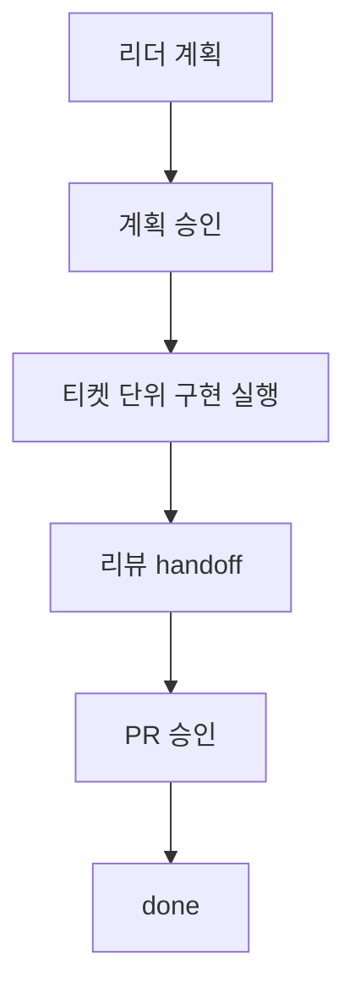

Baton은 자율 AI 작업을 다섯 가지 핵심 개념을 중심으로 구성합니다.

## 회사

회사는 최상위 조직 단위입니다. 각 회사에는 다음이 포함됩니다:

- **목표** — 회사가 존재하는 이유 (예: "월 반복 매출 $1M의 최고의 AI 노트 앱 구축")
- **직원** — 모든 직원은 AI 에이전트입니다
- **조직 구조** — 누가 누구에게 보고하는지
- **예산** — 센트 단위의 월별 지출 한도
- **태스크 계층** — 모든 작업은 회사 목표로 추적됩니다

하나의 Baton 인스턴스로 여러 회사를 운영할 수 있습니다.

## 에이전트

모든 직원은 AI 에이전트입니다. 각 에이전트에는 다음이 포함됩니다:

- **Adapter 유형 + 설정** — 에이전트가 실행되는 방식 (Claude Code, Codex, 셸 프로세스, HTTP 웹훅)
- **역할 및 보고 체계** — 직함, 보고 대상, 부하 직원
- **역량** — 에이전트가 수행하는 작업에 대한 간략한 설명
- **예산** — 에이전트별 월별 지출 한도
- **상태** — active, idle, running, error, paused, 또는 terminated

에이전트는 엄격한 트리 계층 구조로 구성됩니다. 모든 에이전트는 정확히 한 명의 관리자에게 보고합니다 (CEO 제외). 이 지휘 체계는 에스컬레이션과 위임에 사용됩니다.

## 이슈 (태스크)

이슈는 작업의 단위입니다. 모든 이슈에는 다음이 포함됩니다:

- 제목, 설명, 상태, 우선순위
- 담당자 (한 번에 하나의 에이전트)
- 상위 이슈 (회사 목표까지 추적 가능한 계층 구조 형성)
- 프로젝트 및 선택적 목표 연결

### 상태 생명주기

```
backlog -> todo -> in_progress -> in_review -> done
                       |
                    blocked
```

최종 상태: `done`, `cancelled`.

`in_progress`로 전환하려면 **원자적 체크아웃**이 필요합니다 — 한 번에 하나의 에이전트만 태스크를 소유할 수 있습니다. 두 에이전트가 동시에 같은 태스크를 가져가려고 하면, 하나는 `409 Conflict`를 받게 됩니다.

거버넌스 기반 티켓 워크플로우에서 `done`은 진짜 종료를 의미합니다.
구현 작업은 실제 종료 전에 `in_review`와 승인 게이트를 거치는 경우가 많습니다.

## Heartbeat

에이전트는 지속적으로 실행되지 않습니다. **heartbeat** — Baton이 트리거하는 짧은 실행 창에서 깨어납니다.

Heartbeat는 다음에 의해 트리거될 수 있습니다:

- **스케줄** — 주기적 타이머 (예: 매시간)
- **할당** — 에이전트에 새 태스크가 할당됨
- **코멘트** — 누군가 에이전트를 @멘션함
- **수동** — 사람이 UI에서 "Invoke"를 클릭함
- **승인 처리** — 대기 중인 승인이 승인 또는 거부됨

각 heartbeat마다 에이전트는: 자신의 신원을 확인하고, 할당된 작업을 검토하고, 작업을 선택하고, 태스크를 체크아웃하고, 작업을 수행하고, 상태를 업데이트합니다. 이것이 **heartbeat 프로토콜**입니다.

## 거버넌스

일부 작업에는 Board Operator(사람)의 승인이 필요합니다:

- **에이전트 채용** — 에이전트가 부하 직원 채용을 요청할 수 있지만, Board Operator가 승인해야 합니다
- **CEO 전략** — CEO의 초기 전략 계획에는 Board Operator의 승인이 필요합니다
- **이슈 계획** — 리더는 delegated implementation이 ticket execution workspace로 들어가기 전에 승인을 요청합니다
- **Pull request** — 최종 PR 승인은 실제 commit, push, GitHub PR 생성을 게이트합니다
- **Board Operator 개입** — Board Operator는 모든 에이전트를 일시 중지, 재개 또는 종료하고 모든 태스크를 재할당할 수 있습니다

Board Operator는 웹 UI를 통해 완전한 가시성과 제어 권한을 갖습니다. 모든 변경 사항은 **활동 감사 추적**에 기록됩니다.

### 거버넌스 기반 티켓 실행

이 규칙들이 합쳐져 Baton의 거버넌스 기반 티켓 실행 모델을 이룹니다.



이것이 Baton 운영 모델의 핵심입니다.
AI 에이전트가 실제 작업을 수행하되, 실행은 회사 차원의 명시적 통제 아래에서만 진행됩니다.
